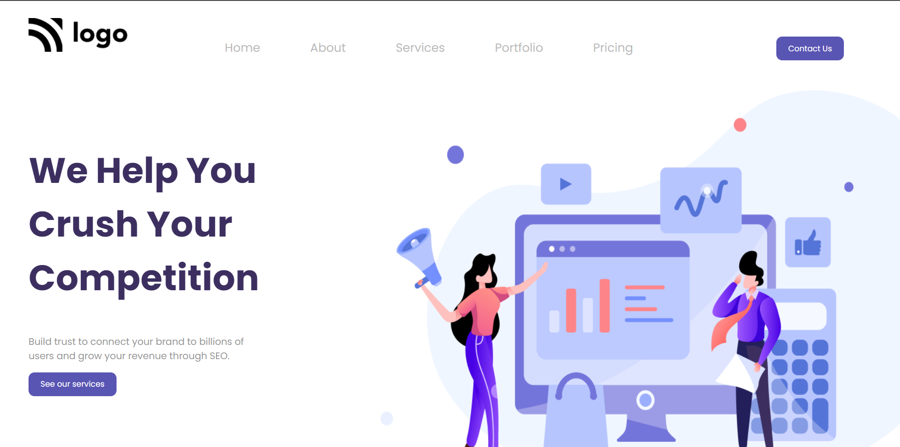

# Hello I am **Devang** and Welcome to Digital Marketing Page.

## 💻 Tech Stack Used :

  

 

 ## Project Name : Digital Marketing Page !

 
After completing this project I have a much more clear understanding of positions in CSS. Starting was a bit bumpy with postions now i have much more clear idea of when to use relative and when to use absolute.
 

 ## Time for completion: 5 hrs 
 

 
### Do Check it Live on Below Link :

[Live Link !]()